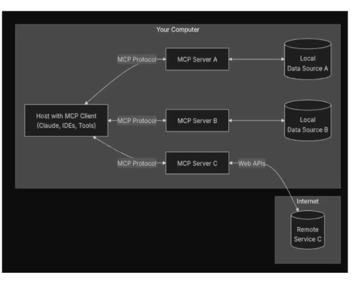

# MCP

- Es un protocolo que diseño antropic (claude) y es un estandard para conectarse a otras herramientas.

- Porque aparece? porque yo por ejemplo le puedo pedir que escriba un mail pero no mandarlo, por eso aparecieron las herramientas.

# Arquitectura

# Como configurarlo?

- Desde claude se puede configurar un mcp.

- Por ejemplo hacer consultas en base de datos.

