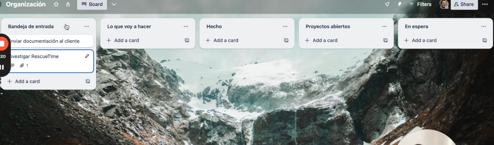

## 1. HERRAMIENTAS DE PRODUCTIVIDAD

### TRELLO

Es la herramienta mas facil de usar.

# Estructura

- bandeja entrada:

es para trackear lo que tengo que hacer.

- lo que voy a hacer es lo que voy a hacer en el dia

# Proyectos abiertos

- sirve para tener un panorama de en todso los proyectos para saber decir que no.

### tack toogle.com

- minuto 14 24(herramientas y productividad)

## Perplexity

Para investigar cosas en internet es el mejor.
ya que esta hecho paso eso. gemini tambein tiene un buscador con ia.
Busca directamente en internet en tiempo real.
Remplaza a un buscador no interpreta la informacion

## Crear slides automaticas.

- gamma esta buena.

## Crear guias paso a paso con ia.(osea mostrar pasos por ejemplo sobre como se usa una app)

Herramienta guidde.

