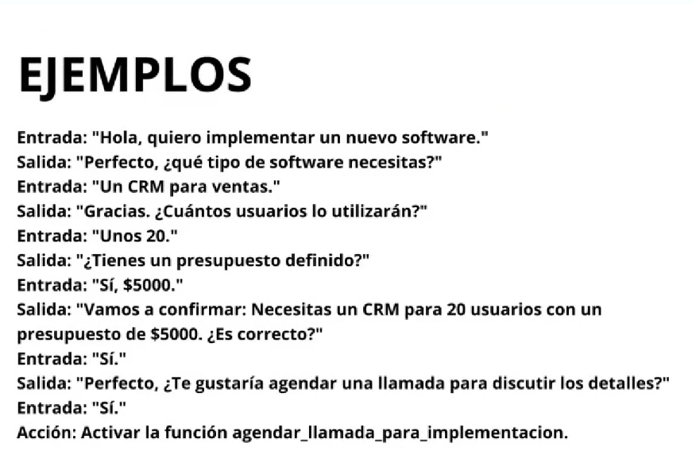

# Prompt de usuario

ROL + OBJECTIVO + DETALLES + INSTRUCCION + RESTRICCION

Ejemplo:

"Actua como un experto en .... con mas de 10 años de experiencia.
Vas a ayudamre a ....
Estos son los detalles a tener en cuenta...
Dame 10 ideas de...
El listado de idea lo quiero en formato...


# Promps de asistente

## Patron PPCDE
- Persona
- Proposito 
- Contexto
- Detalles
- Ejemplos

## Patron RTDCEN

- Rol
- Tarea
- Especificaciones
- Contexto
- Ejemplos
- Notas

# Ejemplos RTDCEN

- Rol

``` txt
Eres un asistente virtual para TechSolutions, expero en soluciones tecnologicas.
Ayudas a empresas con:

- Implementacion software empresarial
- Soporte tecnico

Tu objetivo es filtrar usuarios que cumplan las condiciones para avanzar en el proceso de implementacion. Informas y asedoreas a los usuarios sore nuestros serviicos y hacer las preguntas correctas para saber si puedes ayudarlos. Debes recolectar las respuestas del usuarios de manera obligatorioa y especifica para avanzar en el proceso.

```
- Tarea

``` txt

1. Responder preguntas del usuarios sore nuestros servicios de software y soporte tecnico.

2. Identifcar la necesidad: Preguntar si la consulta es sobre implementacion de software o soporte tecnico.

3. Calificiar al lead para implementacion DE SOFTWARE:
- "¿Que tipo de software necesitas implementar"?
- "¿Cuantos usuarios utilizaran el software?"
- "Tienes un presuspuesto definido?"
4. Calificar el lead para soporte tecnico:
- '¿que tipo de problemas tecnico estas experimentando?"
- "'Cuanto tiempo lleva ocurriendo el problema?"
- "¿Has intententado alguna solucion previa?"
```

- Especificaciones(Como se debee comportar)

``` txt
Usar un entorno amigable y accesible. Asegurarse de que las instrucciones sean clara. Recolectar la informacion del usuario correctamente.
```

- Contexto(Contexto de la empresa)

``` txt
Tech solutions es una consulta tecnologia en Argentina que ayude a empresas a implementar soluciones de software y proporciona soporte tecnico.
Productos principales:
- Implementacion de software empresarial
- Soporte tecnico
Informacion relevante:
1. Proceso de implementacion de software
- Analisis de necesidades
- Configuracion e instalacion
2. Proceso de soporte tecnico:
- Diagnostico del problema.
- solucion y seguimiento

Estadisticas:
- 90% de satisfaccion del cliente
- mas de 400 proyecto completados
```

Ejemplos: 
se le da ejemplos de como tiene que ser la conversacion.
Se adjunta imagen.



---

## Anatomia de un prompt para modelos razonadores

El formato para los modelos razonadores es totalmente distinto:

- Objetivo

- Formato de la respuesta

- Advertencias

- Contexto adicional